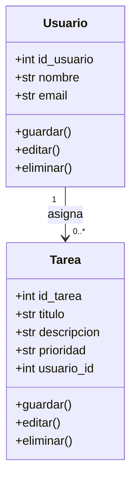
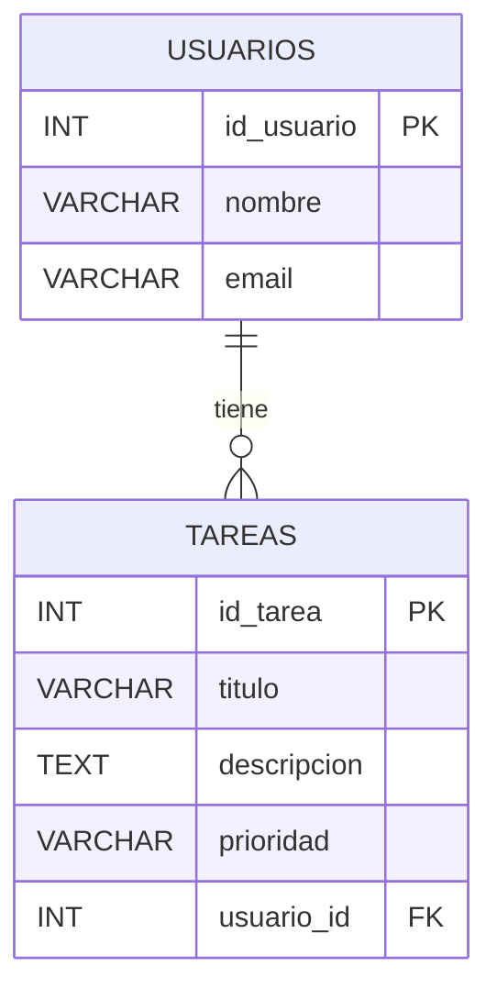

# Manual Técnico — Sistema de Gestión de Usuarios y Tareas (EC0835)

## Índice
1. Introducción  
2. Objetivo general  
3. Objetivos específicos  
4. Requerimientos de instalación  
6. Diagramas técnicos  
   - Diagrama de clases  
   - Diagrama Entidad–Relación  
7. Desarrollo y código  de la aplicación 
8. Procedimiento de instalación y ejecución  
9. Generación del ejecutable  

---

## 1. Introducción
El sistema de **Gestión de Usuarios y Tareas** es una aplicación de escritorio desarrollada en **Python 3.10+** utilizando:  
- **Tkinter** como librería gráfica para la interfaz de usuario.  
- **SQLite** como motor de base de datos local.  

El objetivo es demostrar en la certificación EC0835 que se dominan las operaciones básicas de programación y gestión de bases de datos:  
- **Inserción, selección, actualización y eliminación de registros**.  
- Uso de consultas con **JOIN** y **GROUP BY**.  
- Validación del funcionamiento a través de la interfaz y la base de datos.  

---

## 2. Objetivo general
Desarrollar y documentar un sistema CRUD completo para la gestión de usuarios y tareas, capaz de ejecutarse en cualquier equipo Windows y entregarse como producto en formato `.exe`.

---

## 3. Objetivos específicos
- Registrar, editar y eliminar **Usuarios**.  
- Registrar, editar, eliminar y consultar **Tareas**.  
- Implementar consultas SQL que:  
  - Relacionen tareas con sus usuarios (JOIN).  
  - Generen un resumen de tareas por usuario (GROUP BY).  
- Entregar el sistema en formato digital y ejecutable (`.exe`).  

---

## 4. Requerimientos de instalación
### Hardware mínimo
- Procesador: Dual Core 2.0 GHz  
- RAM: 4 GB  
- Disco: 500 MB libres  

### Software
- **Sistema operativo:** Windows 10/11  
- **Python:** 3.10 o superior  
- **SQLite:** integrado en Python  
- **Dependencias (requirements.txt):**  
  ```txt
  tk
  pyinstaller
  ```


## 5. Diagramas técnicos
### 6.1. Diagrama de clases (UML)


### 6.2. Diagrama Entidad–Relación (ER)


---

---


# 7. Desarrollo técnico y código

## . Estructura del proyecto
Recomendamos organizar el proyecto en cuatro archivos principales:

```
proyecto_tareas/
│  main.py       # Interfaz Tkinter
│  crud.py       # Funciones de base de datos (CRUD)
│  models.py     # Clases Usuario y Tarea
│  db.py         # Conexión SQLite y creación de tablas
│  requirements.txt
└─ tareas.db     # Base de datos SQLite
```


---

- **db.py:** crea la base `tareas.db` y define las tablas.  
- **models.py:** clases `Usuario` y `Tarea` con atributos y métodos.  
- **crud.py:** operaciones CRUD (`INSERT`, `UPDATE`, `DELETE`, `SELECT`) y consultas avanzadas (`JOIN`, `GROUP BY`).  
- **main.py:** interfaz gráfica con botones para cada operación.  

> El código fuente completo se entrega como parte del proyecto en formato `.py`.

---

## 8. Procedimiento de instalación y ejecución
1. Clonar o descargar el proyecto.  
2. Crear entorno virtual:  
   ```powershell
   python -m venv venv
   venv\Scripts\activate
   ```  
3. Instalar dependencias:  
   ```powershell
   pip install -r requirements.txt
   ```  
4. Ejecutar el sistema:  
   ```powershell
   python main.py
   ```  

---

## 9. Generación del ejecutable
1. Instalar PyInstaller:  
   ```powershell
   pip install pyinstaller
   ```  
2. Crear el `.exe`:  
   ```powershell
   pyinstaller --onefile main.py
   ```  
3. Copiar la base `tareas.db` a la misma carpeta del ejecutable (`dist/`).  
4. Validar la ejecución en un equipo sin Python instalado.  

---

