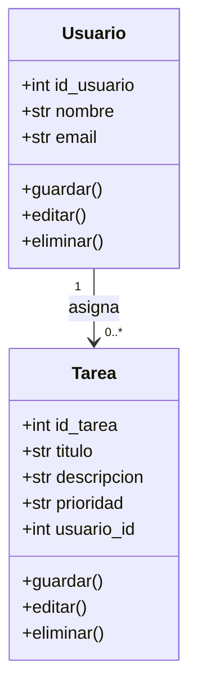
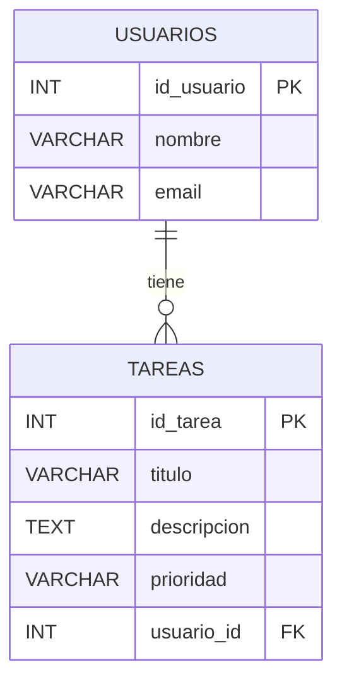

# Manual Técnico — Sistema de Gestión de Usuarios y Tareas (EC0835)

## Índice
1. Introducción  
2. Objetivo general  
3. Objetivos específicos  
4. Requerimientos de instalación  
6. Diagramas técnicos  
   - Diagrama de clases  
   - Diagrama Entidad–Relación  
7. Desarrollo y código  de la aplicación 
8. Procedimiento de instalación y ejecución  
9. Generación del ejecutable  

---

## 1. Introducción
El sistema de **Gestión de Usuarios y Tareas** es una aplicación de escritorio desarrollada en **Python 3.10+** utilizando:  
- **Tkinter** como librería gráfica para la interfaz de usuario.  
- **SQLite** como motor de base de datos local.  

El objetivo es demostrar en la certificación EC0835 que se dominan las operaciones básicas de programación y gestión de bases de datos:  
- **Inserción, selección, actualización y eliminación de registros**.  
- Uso de consultas con **JOIN** y **GROUP BY**.  
- Validación del funcionamiento a través de la interfaz y la base de datos.  

---

## 2. Objetivo general
Desarrollar y documentar un sistema CRUD completo para la gestión de usuarios y tareas, capaz de ejecutarse en cualquier equipo Windows y entregarse como producto en formato `.exe`.

---

## 3. Objetivos específicos
- Registrar, editar y eliminar **Usuarios**.  
- Registrar, editar, eliminar y consultar **Tareas**.  
- Implementar consultas SQL que:  
  - Relacionen tareas con sus usuarios (JOIN).  
  - Generen un resumen de tareas por usuario (GROUP BY).  
- Entregar el sistema en formato digital y ejecutable (`.exe`).  

---

## 4. Requerimientos de instalación
### Hardware mínimo
- Procesador: Dual Core 2.0 GHz  
- RAM: 4 GB  
- Disco: 500 MB libres  

### Software
- **Sistema operativo:** Windows 10/11  
- **Python:** 3.10 o superior  
- **SQLite:** integrado en Python  
- **Dependencias (requirements.txt):**  
  ```txt
  tk
  pyinstaller
  ```


## 5. Diagramas técnicos
### 6.1. Diagrama de clases (UML)


### 6.2. Diagrama Entidad–Relación (ER)


---

---


# 7. Desarrollo técnico y código

## . Estructura del proyecto
Recomendamos organizar el proyecto en cuatro archivos principales:

```
proyecto_tareas/
│  main.py       # Interfaz Tkinter
│  crud.py       # Funciones de base de datos (CRUD)
│  models.py     # Clases Usuario y Tarea
│  db.py         # Conexión SQLite y creación de tablas
│  requirements.txt
└─ tareas.db     # Base de datos SQLite
```

## . Código de aplicación

**Crud.py**
```python
from db import get_connection

# ============ USUARIOS ============
def registrar_usuario(nombre, email):
    con = get_connection()
    cur = con.cursor()
    cur.execute("INSERT INTO Usuarios (nombre, email) VALUES (?, ?)", (nombre, email))
    con.commit()
    con.close()

def editar_usuario(id_usuario, nombre, email):
    con = get_connection()
    cur = con.cursor()
    cur.execute("UPDATE Usuarios SET nombre=?, email=? WHERE id_usuario=?", (nombre, email, id_usuario))
    con.commit()
    con.close()

def eliminar_usuario(id_usuario):
    con = get_connection()
    cur = con.cursor()
    cur.execute("DELETE FROM Usuarios WHERE id_usuario=?", (id_usuario,))
    con.commit()
    con.close()

def obtener_usuarios():
    con = get_connection()
    cur = con.cursor()
    cur.execute("SELECT id_usuario, nombre, email FROM Usuarios")
    datos = cur.fetchall()
    con.close()
    return datos

# ============ TAREAS ============
def registrar_tarea(titulo, descripcion, prioridad, usuario_id):
    con = get_connection()
    cur = con.cursor()
    cur.execute("INSERT INTO Tareas (titulo, descripcion, prioridad, usuario_id) VALUES (?, ?, ?, ?)",
                (titulo, descripcion, prioridad, usuario_id))
    con.commit()
    con.close()

def editar_tarea(id_tarea, titulo, descripcion, prioridad, usuario_id):
    con = get_connection()
    cur = con.cursor()
    cur.execute("UPDATE Tareas SET titulo=?, descripcion=?, prioridad=?, usuario_id=? WHERE id_tarea=?",
                (titulo, descripcion, prioridad, usuario_id, id_tarea))
    con.commit()
    con.close()

def eliminar_tarea(id_tarea):
    con = get_connection()
    cur = con.cursor()
    cur.execute("DELETE FROM Tareas WHERE id_tarea=?", (id_tarea,))
    con.commit()
    con.close()

def obtener_tareas():
    con = get_connection()
    cur = con.cursor()
    cur.execute("""
        SELECT T.id_tarea, T.titulo, T.prioridad, U.nombre
        FROM Tareas T
        JOIN Usuarios U ON T.usuario_id = U.id_usuario
    """)
    datos = cur.fetchall()
    con.close()
    return datos

def filtrar_tareas_por_usuario(usuario_id):
    con = get_connection()
    cur = con.cursor()
    cur.execute("""
        SELECT titulo, prioridad FROM Tareas
        WHERE usuario_id=?
    """, (usuario_id,))
    datos = cur.fetchall()
    con.close()
    return datos

def resumen_tareas_por_usuario():
    con = get_connection()
    cur = con.cursor()
    cur.execute("""
        SELECT U.nombre, COUNT(T.id_tarea) 
        FROM Usuarios U
        LEFT JOIN Tareas T ON U.id_usuario = T.usuario_id
        GROUP BY U.nombre
    """)
    datos = cur.fetchall()
    con.close()
    return datos

**db.py**
```python
import sqlite3

DB_NAME = "tareas.db"

def get_connection():
    return sqlite3.connect(DB_NAME)

def init_db():
    con = get_connection()
    cur = con.cursor()

    cur.execute("""
    CREATE TABLE IF NOT EXISTS Usuarios (
        id_usuario INTEGER PRIMARY KEY AUTOINCREMENT,
        nombre TEXT NOT NULL,
        email TEXT NOT NULL
    )
    """)

    cur.execute("""
    CREATE TABLE IF NOT EXISTS Tareas (
        id_tarea INTEGER PRIMARY KEY AUTOINCREMENT,
        titulo TEXT NOT NULL,
        descripcion TEXT,
        prioridad TEXT,
        usuario_id INTEGER,
        FOREIGN KEY(usuario_id) REFERENCES Usuarios(id_usuario)
    )
    """)

    con.commit()
    con.close()
**main.py**
```python
import tkinter as tk
from tkinter import messagebox, simpledialog
from crud import (
    registrar_usuario, editar_usuario, eliminar_usuario, obtener_usuarios,
    registrar_tarea, editar_tarea, eliminar_tarea, obtener_tareas,
    filtrar_tareas_por_usuario, resumen_tareas_por_usuario
)
from db import init_db

# Inicializar base
init_db()

# ===== Funciones auxiliares =====
def limpiar_campos():
    entry_nombre.delete(0, tk.END)
    entry_email.delete(0, tk.END)
    entry_titulo.delete(0, tk.END)
    entry_descripcion.delete(0, tk.END)
    entry_prioridad.delete(0, tk.END)
    entry_usuario_id.delete(0, tk.END)

def mostrar_usuarios_gui():
    registros = obtener_usuarios()
    lista.delete(0, tk.END)
    for r in registros:
        lista.insert(tk.END, f"ID:{r[0]} | Nombre:{r[1]} | Email:{r[2]}")

def mostrar_tareas_gui():
    registros = obtener_tareas()
    lista.delete(0, tk.END)
    for r in registros:
        lista.insert(tk.END, f"ID:{r[0]} | {r[1]} | Prioridad:{r[2]} | Usuario:{r[3]}")

# ===== Eventos GUI =====
def registrar_usuario_gui():
    if entry_nombre.get() and entry_email.get():
        registrar_usuario(entry_nombre.get(), entry_email.get())
        limpiar_campos()
        mostrar_usuarios_gui()
    else:
        messagebox.showwarning("Error", "Debes ingresar nombre y correo")

def editar_usuario_gui():
    id_usuario = simpledialog.askinteger("Editar Usuario", "ID del usuario a editar:")
    if id_usuario:
        nuevo_nombre = simpledialog.askstring("Nuevo Nombre", "Ingrese nuevo nombre:")
        nuevo_email = simpledialog.askstring("Nuevo Email", "Ingrese nuevo email:")
        editar_usuario(id_usuario, nuevo_nombre, nuevo_email)
        mostrar_usuarios_gui()

def eliminar_usuario_gui():
    id_usuario = simpledialog.askinteger("Eliminar Usuario", "ID del usuario a eliminar:")
    if id_usuario:
        eliminar_usuario(id_usuario)
        mostrar_usuarios_gui()

def registrar_tarea_gui():
    if entry_titulo.get() and entry_usuario_id.get():
        registrar_tarea(entry_titulo.get(), entry_descripcion.get(), entry_prioridad.get(), entry_usuario_id.get())
        limpiar_campos()
        mostrar_tareas_gui()
    else:
        messagebox.showwarning("Error", "Debes ingresar título e ID de usuario")

def editar_tarea_gui():
    id_tarea = simpledialog.askinteger("Editar Tarea", "ID de la tarea a editar:")
    if id_tarea:
        nuevo_titulo = simpledialog.askstring("Nuevo Título", "Ingrese nuevo título:")
        nueva_desc = simpledialog.askstring("Nueva Descripción", "Ingrese nueva descripción:")
        nueva_prioridad = simpledialog.askstring("Nueva Prioridad", "Ingrese nueva prioridad:")
        nuevo_usuario_id = simpledialog.askinteger("Nuevo Usuario ID", "Ingrese nuevo ID de usuario:")
        editar_tarea(id_tarea, nuevo_titulo, nueva_desc, nueva_prioridad, nuevo_usuario_id)
        mostrar_tareas_gui()

def eliminar_tarea_gui():
    id_tarea = simpledialog.askinteger("Eliminar Tarea", "ID de la tarea a eliminar:")
    if id_tarea:
        eliminar_tarea(id_tarea)
        mostrar_tareas_gui()

def filtrar_tareas_gui():
    usuario_id = entry_usuario_id.get()
    if not usuario_id.isdigit():
        messagebox.showwarning("Error", "Debes ingresar un ID válido")
        return
    registros = filtrar_tareas_por_usuario(usuario_id)
    lista.delete(0, tk.END)
    for r in registros:
        lista.insert(tk.END, f"Tarea:{r[0]} | Prioridad:{r[1]}")

def resumen_tareas_gui():
    registros = resumen_tareas_por_usuario()
    lista.delete(0, tk.END)
    for r in registros:
        lista.insert(tk.END, f"Usuario:{r[0]} | Total tareas:{r[1]}")

# ===== GUI =====
ventana = tk.Tk()
ventana.title("Gestión de Usuarios y Tareas")
ventana.geometry("650x600")

# ---- Frame Usuarios ----
frame_usuarios = tk.LabelFrame(ventana, text="Usuarios", padx=10, pady=10)
frame_usuarios.grid(row=0, column=0, padx=10, pady=10, sticky="n")

tk.Label(frame_usuarios, text="Nombre:").grid(row=0, column=0)
entry_nombre = tk.Entry(frame_usuarios); entry_nombre.grid(row=0, column=1)

tk.Label(frame_usuarios, text="Email:").grid(row=1, column=0)
entry_email = tk.Entry(frame_usuarios); entry_email.grid(row=1, column=1)

tk.Button(frame_usuarios, text="Registrar Usuario", command=registrar_usuario_gui).grid(row=2, column=0, columnspan=2, pady=5)
tk.Button(frame_usuarios, text="Editar Usuario", command=editar_usuario_gui).grid(row=3, column=0, columnspan=2, pady=5)
tk.Button(frame_usuarios, text="Eliminar Usuario", command=eliminar_usuario_gui).grid(row=4, column=0, columnspan=2, pady=5)
tk.Button(frame_usuarios, text="Mostrar Usuarios", command=mostrar_usuarios_gui).grid(row=5, column=0, columnspan=2, pady=5)

# ---- Frame Tareas ----
frame_tareas = tk.LabelFrame(ventana, text="Tareas", padx=10, pady=10)
frame_tareas.grid(row=0, column=1, padx=10, pady=10, sticky="n")

tk.Label(frame_tareas, text="Título:").grid(row=0, column=0)
entry_titulo = tk.Entry(frame_tareas); entry_titulo.grid(row=0, column=1)

tk.Label(frame_tareas, text="Descripción:").grid(row=1, column=0)
entry_descripcion = tk.Entry(frame_tareas); entry_descripcion.grid(row=1, column=1)

tk.Label(frame_tareas, text="Prioridad:").grid(row=2, column=0)
entry_prioridad = tk.Entry(frame_tareas); entry_prioridad.grid(row=2, column=1)

tk.Label(frame_tareas, text="ID Usuario:").grid(row=3, column=0)
entry_usuario_id = tk.Entry(frame_tareas); entry_usuario_id.grid(row=3, column=1)

tk.Button(frame_tareas, text="Registrar Tarea", command=registrar_tarea_gui).grid(row=4, column=0, columnspan=2, pady=5)
tk.Button(frame_tareas, text="Editar Tarea", command=editar_tarea_gui).grid(row=5, column=0, columnspan=2, pady=5)
tk.Button(frame_tareas, text="Eliminar Tarea", command=eliminar_tarea_gui).grid(row=6, column=0, columnspan=2, pady=5)
tk.Button(frame_tareas, text="Mostrar Tareas", command=mostrar_tareas_gui).grid(row=7, column=0, columnspan=2, pady=5)
tk.Button(frame_tareas, text="Filtrar por Usuario", command=filtrar_tareas_gui).grid(row=8, column=0, columnspan=2, pady=5)
tk.Button(frame_tareas, text="Resumen por Usuario", command=resumen_tareas_gui).grid(row=9, column=0, columnspan=2, pady=5)

# ---- Frame Resultados ----
frame_resultados = tk.LabelFrame(ventana, text="Resultados", padx=10, pady=10)
frame_resultados.grid(row=1, column=0, columnspan=2, padx=10, pady=10)

lista = tk.Listbox(frame_resultados, width=100, height=20)
lista.pack()

ventana.mainloop()


---

- **db.py:** crea la base `tareas.db` y define las tablas.  
- **models.py:** clases `Usuario` y `Tarea` con atributos y métodos.  
- **crud.py:** operaciones CRUD (`INSERT`, `UPDATE`, `DELETE`, `SELECT`) y consultas avanzadas (`JOIN`, `GROUP BY`).  
- **main.py:** interfaz gráfica con botones para cada operación.  

> El código fuente completo se entrega como parte del proyecto en formato `.py`.

---

## 8. Procedimiento de instalación y ejecución
1. Clonar o descargar el proyecto.  
2. Crear entorno virtual:  
   ```powershell
   python -m venv venv
   venv\Scripts\activate
   ```  
3. Instalar dependencias:  
   ```powershell
   pip install -r requirements.txt
   ```  
4. Ejecutar el sistema:  
   ```powershell
   python main.py
   ```  

---

## 9. Generación del ejecutable
1. Instalar PyInstaller:  
   ```powershell
   pip install pyinstaller
   ```  
2. Crear el `.exe`:  
   ```powershell
   pyinstaller --onefile main.py
   ```  
3. Copiar la base `tareas.db` a la misma carpeta del ejecutable (`dist/`).  
4. Validar la ejecución en un equipo sin Python instalado.  

---

